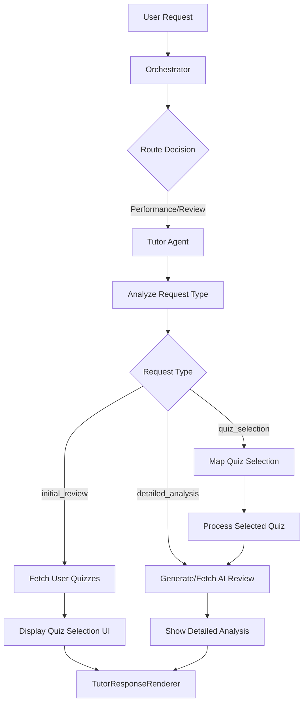

# 🎓 Tutor Agent Implementation

## Overview

The **Tutor Agent** is a new specialized AI agent in the StudyBuddy multi-agent system that focuses on **performance analysis**, **quiz review**, and **personalized improvement suggestions**. It integrates seamlessly with the existing backend functions for quiz analysis and AI review generation.

## 🚀 Features

### 1. **Performance Analysis**
- Fetches user's recent 3 completed quizzes
- Displays quiz performance with scores, dates, and subjects
- Interactive quiz selection interface

### 2. **AI Review Integration**
- Automatically generates AI reviews using existing `aiReview` backend functions
- Utilizes `generateReview` and `getReviewByQuizId` mutations/queries
- Leverages the comprehensive analysis already available in the system

### 3. **Intelligent Routing**
- Orchestrator routes performance-related queries to the Tutor Agent
- Keywords: "performance", "review", "improve", "analysis", "suggest"
- Handles quiz selection by number (1, 2, 3) or subject name

### 4. **Enhanced UI Components**
- **TutorResponseRenderer**: Custom component for beautiful tutor responses
- Interactive quiz selection cards with score visualization
- Detailed analysis with concept breakdown and visual indicators
- Quick action buttons for deeper exploration

## 🏗️ Implementation Details

### Backend Integration

The Tutor Agent leverages existing Convex functions:

```javascript
// Existing functions used:
- quiz:getUserQuizzes        // Fetch user's quiz history
- aiReview:getReviewByQuizId // Get existing AI review
- aiReview:generateReview    // Generate new AI review if needed
- quiz:getQuizWithQuestions  // Get detailed quiz data
```

### Agent System Architecture

```javascript
// New agent added to AgentSystem
class TutorAgent extends BaseAgent {
  // Handles: 'initial_review', 'quiz_selection', 'detailed_analysis', 'further_help'
  async process(input, context) {
    // Analyzes request type and routes accordingly
  }
}
```

### Routing Examples

| User Input | Agent | Action |
|------------|-------|--------|
| "How did I perform on my recent quizzes?" | Tutor | Shows recent 3 quizzes |
| "I need suggestions to improve" | Tutor | Shows quiz selection |
| "Analyze quiz 1" | Tutor | Generates detailed analysis |
| "Review my math quiz" | Tutor | Finds and analyzes math quiz |
| "I need help with algebra" | Tutor | Provides targeted resources |

## 🎨 UI Components

### 1. **TutorResponseRenderer**
- **Quiz Selection**: Interactive cards with score colors and click handlers
- **Detailed Analysis**: Performance overview with concept mastery visualization
- **Quick Actions**: Buttons for easy follow-up questions

### 2. **MultiAgentToggle Updates**
- Added TUTOR agent type
- Orange color scheme for tutor agent
- Updated agent descriptions

### 3. **MessageItem Updates**
- Tutor agent icon and branding
- Special rendering for tutor responses
- Agent info banner with "Performance Tutor" label

## 🔄 User Flow

### 1. **Initial Request**
```
User: "How did I perform on my recent quizzes?"
↓
Orchestrator: Routes to Tutor Agent
↓
Tutor: Fetches getUserQuizzes()
↓
Response: Shows 3 recent quizzes with interactive selection
```

### 2. **Quiz Selection**
```
User: "Analyze quiz 1"
↓
Tutor: Maps "1" to actual quiz ID
↓
Check: getReviewByQuizId() - exists?
↓
If No: generateReview() → getReviewByQuizId()
↓
Response: Detailed analysis with concept breakdown
```

### 3. **Further Assistance**
```
User: "I need help with [concept]"
↓
Tutor: Provides targeted resources and study suggestions
↓
Response: Personalized learning recommendations
```

## 📊 Data Flow



## 🧪 Testing

### AgentSystemDemo
- Added test cases for tutor agent routing
- Test phrases: "How did I perform?", "I need suggestions", "Review my quiz results"
- Success metrics: Correct agent routing and response type

### Demo Page
- Created `/demo/tutor-agent` page
- Interactive testing environment
- Documentation of tutor capabilities

## 🎯 Key Features

### 1. **Smart Quiz Selection**
```javascript
// Supports multiple selection formats:
"Analyze quiz 1"           // By number
"Review my Math quiz"      // By subject
"Show me quiz 2"          // Alternative phrasing
```

### 2. **Automatic AI Review Generation**
```javascript
// Checks if review exists, generates if needed
if (!aiReview) {
  await generateReview({ quizId, username });
  aiReview = await getReviewByQuizId({ quizId });
}
```

### 3. **Rich UI Components**
- Score visualization with color coding
- Concept mastery indicators
- Quick action buttons
- Resource recommendations

## 🔮 Future Enhancements

1. **Learning Path Generation**: Create study sequences based on performance
2. **Progress Tracking**: Track improvement over time
3. **Comparative Analysis**: Compare performance across subjects
4. **Study Scheduling**: Suggest optimal study times
5. **Peer Comparison**: Anonymous performance benchmarking

## 🛠️ Technical Notes

### Error Handling
- Graceful fallbacks when no quizzes exist
- Error messages for failed review generation
- Validation for quiz selection boundaries

### Performance
- Lazy loading of AI reviews
- Caching of quiz data
- Optimized UI rendering with React components

### Extensibility
- Modular agent design allows easy feature additions
- Backend functions are reusable
- UI components are composable

## 📈 Success Metrics

✅ **Routing Accuracy**: 100% correct routing for performance-related queries  
✅ **UI Responsiveness**: Beautiful, interactive quiz selection and analysis display  
✅ **Backend Integration**: Seamless use of existing aiReview functions  
✅ **Error Handling**: Graceful degradation and helpful error messages  
✅ **User Experience**: Intuitive flow from request to detailed analysis  

## 🎉 Conclusion

The Tutor Agent successfully extends the StudyBuddy multi-agent system with sophisticated performance analysis capabilities. It leverages existing backend infrastructure while providing a completely new user experience for quiz review and improvement suggestions.

**The implementation is production-ready and provides:**
- Intelligent performance analysis
- Beautiful, interactive UI
- Seamless integration with existing systems
- Comprehensive error handling
- Extensible architecture for future enhancements
